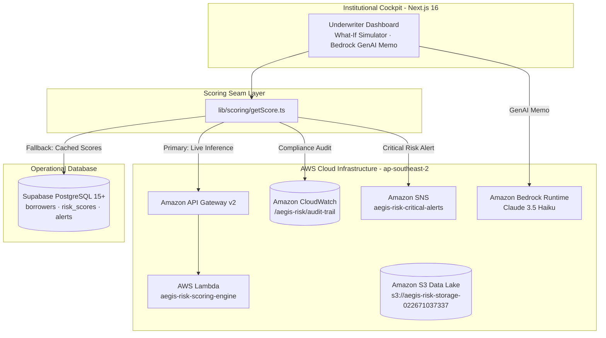

# Aegis Risk — AI-Powered Institutional Loan Default Prediction System

Aegis Risk is an institutional-grade credit risk decisioning and portfolio governance platform designed for underwriting teams, risk officers, and bank actuarial committees. The system evaluates borrower default probability using a calibrated **XGBoost** machine learning model, provides explainable **TreeSHAP** attribution factors to ensure full compliance with the **Equal Credit Opportunity Act (ECOA)** and the **Fair Credit Reporting Act (FCRA)**, and enforces continuous model risk governance under **Federal Reserve SR 11-7** guidelines.

---

## Key Highlights

- **Predictive ML Core:** Calibrated XGBoost gradient boosting classifier with weighted loss functions (`scale_pos_weight = 7.6`) achieving **0.7576 AUC-ROC** across 31 continuous and categorical credit features.
- **Explainable AI (XAI):** Real-time TreeSHAP local attribution feature vectors explaining *why* an applicant was flagged or declined.
- **Serverless AWS Inference Seam:** Live serverless inference via **AWS Lambda + API Gateway** in `ap-southeast-2` (`https://a3q6b9scn0.execute-api.ap-southeast-2.amazonaws.com/`) with zero-downtime database cache fallback.
- **Amazon Bedrock GenAI Assistant:** On-demand generation of institutional Credit Underwriting Memos using **Claude 3.5 Haiku** on AWS Bedrock.
- **Automated Adverse Action Notice:** Instant generation of legally compliant consumer declination letters with top adverse factor disclosures (CFPB Regulation B).
- **Interactive "What-If" Scenario Simulator:** Dynamic counterfactual loan restructuring testing loan amount, tenure, and income elasticities in real time.
- **Portfolio Stress-Testing & Expected Loss:** Actuarial Expected Loss calculation ($$EL = PD \times EAD \times LGD$$) and macroeconomic rate shock simulation (+200 bps Fed Hike).
- **Regulatory Telemetry:** Automatic audit event streaming to **Amazon CloudWatch Logs** (`/aegis-risk/audit-trail`) and underwriter alerts via **Amazon SNS** (`arn:aws:sns:ap-southeast-2:022671037337:aegis-risk-critical-alerts`).

---

## Architecture Overview



---

## Local Development & Setup

### 1. Prerequisites
- **Node.js 18+** & **npm** / **pnpm**
- **Python 3.10+** (with `pip`)
- **AWS CLI v2** (configured with your AWS account credentials)

### 2. Environment Configuration
Copy the configuration template:
```bash
cp .env.example .env
```

Your `.env` should include:
```env
# Operational Database (Supabase)
NEXT_PUBLIC_SUPABASE_URL=https://<your-project>.supabase.co
NEXT_PUBLIC_SUPABASE_ANON_KEY=<your-anon-key>
SUPABASE_SERVICE_ROLE_KEY=<your-service-role-key>

# AWS Cloud Integration Suite (ap-southeast-2)
AWS_REGION=ap-southeast-2
AWS_S3_BUCKET_NAME=aegis-risk-storage-022671037337
AWS_INFERENCE_ENDPOINT_URL=https://a3q6b9scn0.execute-api.ap-southeast-2.amazonaws.com/
AWS_CLOUDWATCH_LOG_GROUP=/aegis-risk/audit-trail
AWS_CLOUDWATCH_ENABLED=true
AWS_SNS_TOPIC_ARN=arn:aws:sns:ap-southeast-2:022671037337:aegis-risk-critical-alerts
```

### 3. Install Dependencies & Build
```bash
# Install frontend & AWS SDK dependencies
npm install

# Run build verification
npm run build

# Start local Next.js dev server
npm run dev
```
Open `http://localhost:3000` in your browser.

---

## AWS Infrastructure & CLI Operations

All cloud resources for Aegis Risk can be verified and managed directly via the AWS CLI:

### 1. S3 Model Registry & Data Lake
Inspect registered model artifacts, drift reports, and datasets:
```bash
aws s3 ls s3://aegis-risk-storage-022671037337 --recursive
```
Synchronize local training artifacts to S3:
```bash
python scripts/aws_s3_sync.py
```

### 2. Live Serverless Inference Endpoint
Test the live AWS Lambda scoring engine directly:
```bash
Invoke-RestMethod -Uri "https://a3q6b9scn0.execute-api.ap-southeast-2.amazonaws.com/" `
  -Method Post `
  -ContentType "application/json" `
  -Body '{"borrower_id": "test-cli", "features": {"monthly_income": 5500, "loan_amount": 25000, "tenure_months": 36, "outstanding_balance": 10000}}' | ConvertTo-Json
```

### 3. Regulatory Audit Trail (Amazon CloudWatch)
Inspect underwriter decision events and compliance telemetry (SR 11-7):
```bash
aws logs get-log-events --log-group-name /aegis-risk/audit-trail --log-stream-name underwriter-decisions --region ap-southeast-2
```

### 4. Critical Underwriter Alerts (Amazon SNS)
Subscribe an underwriter's email or mobile phone to instant notifications:
```bash
aws sns subscribe --topic-arn arn:aws:sns:ap-southeast-2:022671037337:aegis-risk-critical-alerts --protocol email --notification-endpoint your-email@domain.com --region ap-southeast-2
```

---

## Detailed System Documentation

For deep-dive architectural specifications, database migration definitions, regulatory compliance mappings, and presentation pitch flows, refer to:
- **[AEGIS_RISK_IMPLEMENTATION_GUIDE.md](file:///d:/Java-%20Backend/Project/Mass%20Mutual/ai-powered-loan-default-prediction-system/AEGIS_RISK_IMPLEMENTATION_GUIDE.md)**: Authoritative master engineering & institutional specification.
- **[AWS_ONE_DAY_INTEGRATION_PLAN.md](file:///d:/Java-%20Backend/Project/Mass%20Mutual/ai-powered-loan-default-prediction-system/AWS_ONE_DAY_INTEGRATION_PLAN.md)**: Production deployment log, AWS CLI commands, and cloud cost breakdowns.
- **[ml/model_card.md](file:///d:/Java-%20Backend/Project/Mass%20Mutual/ai-powered-loan-default-prediction-system/ml/model_card.md)**: Model card documenting XGBoost metrics, confusion matrices, and limitations.
