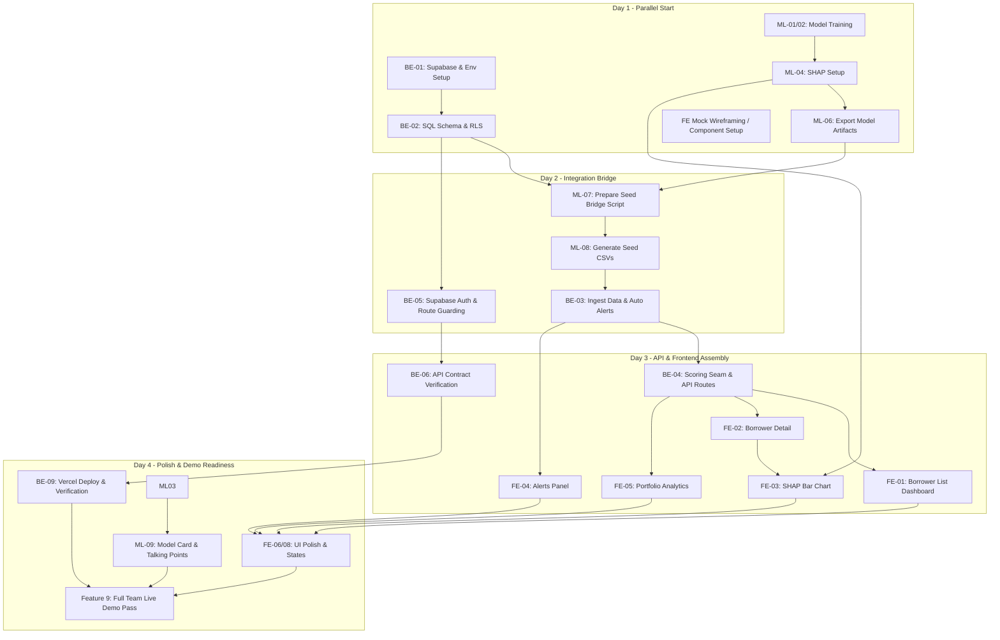

# Aegis Risk — Team Task Breakdown & Dependency Matrix

**Project:** AI-Powered Loan Default Prediction System (PS-01)  
**Team Composition:** 3 Members (ML Engineer, Backend & Infrastructure Engineer, Frontend Engineer)  
**Based on:** `AEGIS_RISK_IMPLEMENTATION_GUIDE.md`  

---

## 1. Executive Summary & Workload Distribution

To ensure balanced delivery and zero idle time, tasks are divided equally across the 3 roles based on domain specialization, estimated effort, and execution phases.

| Role | Primary Responsibility | Assigned Features | Effort Weight |
|---|---|---|---|
| **Person 1: ML Engineer** | Model training, evaluation, SHAP explainability, bridge/seed generation script | Feature 2, Feature 3 (Lead), Feature 9 (ML Polish) | ~33.3% |
| **Person 2: Backend & Infra** | Supabase setup, DB migrations, RLS, Auth, Seeding, API routes, scoring seam | Feature 0, Feature 1, Feature 3 (Review), Feature 4, Feature 9 (Infra Polish) | ~33.3% |
| **Person 3: Frontend Engineer** | Dashboard UI, Borrower list/details, SHAP charts, Alerts, Analytics, UX polish | Feature 5, Feature 6, Feature 7, Feature 8, Feature 9 (UI Polish) | ~33.3% |

---

## 2. Priority Definition

- **P0 (Blocker / Critical Path):** Must be completed first to unblock other teammates or critical system pathways.
- **P1 (High Priority):** Core application features essential for functional end-to-end demo.
- **P2 (Medium Priority):** Enhancements, drift simulation, secondary status actions.
- **P3 (Future / Out of Scope):** AWS SageMaker/Kinesis migration (post-demo phase).

---

## 3. Detailed Task Breakdown by Person

### 🧑‍💻 Person 1: Machine Learning Engineer (ML Lead)

| Task ID | Task Description | Priority | Guide Ref | Unblocks / Feeds |
|---|---|---|---|---|
| **ML-01** | **Dataset Exploration & Stratified Split:** Load `Loan_default_cleaned.csv`, inspect 32 columns, perform stratified 80/20 train/test split on `Default` target (11.6% positive rate). | **P0** | Feature 2 | ML-02 |
| **ML-02** | **Baseline & Primary Model Training:** Train Logistic Regression baseline; train primary XGBoost with `scale_pos_weight ≈ 7.6` to handle class imbalance without SMOTE. | **P0** | Feature 2 | ML-03, ML-04 |
| **ML-03** | **Model Evaluation & Metrics:** Generate AUC-ROC, Precision-Recall curves, and Confusion Matrix. Create `ml/model_card.md` documenting performance metrics and limitations. | **P1** | Feature 2 | Team Demo / ML-07 |
| **ML-04** | **SHAP Explainability Pipeline:** Implement TreeSHAP for XGBoost; generate global importance plot; build single-row explanation function returning top-3 contributing features with impact direction (+/-). | **P0** | Feature 2 | ML-06, FE-03 |
| **ML-05** | **Model Drift Simulation (Presentation Asset):** Train on a subset, test on alternate slice, calculate accuracy/AUC degradation to demonstrate model lifecycle need. | **P2** | Feature 2 | Final Presentation |
| **ML-06** | **ML Artifact Serialization:** Save `model.json` (or `.pkl`) and strict input order mapping `feature_columns.json` in `/ml` folder. | **P0** | Feature 2 | ML-07, BE-04 |
| **ML-07** | **Data Bridge & Seed Generation Script:** Write `scripts/prepare_seed_data.py`. Sample 300–500 rows, reverse one-hot encodings (`LoanPurpose`, `EmploymentType`), synthesize names/emails using `faker`, assign geography, derive monthly income & outstanding balances. | **P0** | Feature 3 | ML-08 |
| **ML-08** | **Batch Scoring & Reason Generation:** Run trained XGBoost + SHAP against the sampled dataset; map probability into risk buckets (`low`, `medium`, `high`, `critical`); export `seed_borrowers.csv` and `seed_scores_reasons.csv`. | **P0** | Feature 3 | BE-03 |
| **ML-09** | **ML Polish & Stakeholder Talking Points:** Document "what is real vs. simulated", ensure feature descriptions in reasons are human-readable for credit officers. | **P1** | Feature 9 | Final Demo |

---

### 🛠️ Person 2: Backend & Infrastructure Engineer

| Task ID | Task Description | Priority | Guide Ref | Unblocks / Feeds |
|---|---|---|---|---|
| **BE-01** | **Supabase Project & Environment Setup:** Provision team Supabase project, create `.env.example`, securely distribute `NEXT_PUBLIC_SUPABASE_URL` and `NEXT_PUBLIC_SUPABASE_PUBLISHABLE_KEY`. | **P0** | Feature 0 | All (Team Blocker) |
| **BE-02** | **Database Schema & RLS Migrations:** Write `supabase/migrations/0001_init.sql` defining `borrowers`, `risk_scores`, `risk_reasons`, and `alerts` tables with foreign keys and cascade rules. Enable RLS and authenticated read policies. | **P0** | Feature 0 | ML-07, BE-03, FE-01 |
| **BE-03** | **Seed Data Ingestion & Alerts Setup:** Load `seed_borrowers.csv` and `seed_scores_reasons.csv` into Supabase. Run SQL script to auto-generate `alerts` records for all `high` and `critical` risk borrowers. | **P0** | Feature 4 | BE-04, FE-01 |
| **BE-04** | **Scoring Seam Implementation:** Create adapter `lib/scoring/getScore.ts` for unified score retrieval. Update `/app/api/borrowers/[id]/score/route.ts` to call this seam, isolating DB read from future live ML endpoint. | **P0** | Feature 4 | FE-02, FE-03 |
| **BE-05** | **Authentication & Route Guarding:** Configure Supabase Email/Password auth; set up shared team dev account (`demo@aegisrisk.test`); verify `middleware.ts` redirects unauthenticated traffic from protected pages (`/borrowers`, `/alerts`, `/analytics`) and API routes. | **P0** | Feature 1 | FE-01, FE-04 |
| **BE-06** | **API Contract Verification:** Verify all four API endpoints (`GET /api/borrowers`, `GET /api/borrowers/:id/score`, `GET /api/alerts`, `GET /api/analytics/portfolio`) conform strictly to `docs/api-contract.md`. | **P0** | Feature 4 | FE-01..FE-05 |
| **BE-07** | **Alert Status API (Optional Enhancement):** Implement `PATCH /api/alerts/:id` to allow toggling status (`open` -> `acknowledged` -> `resolved`). | **P2** | Feature 7 | FE-04 |
| **BE-08** | **Repository Standards & Documentation:** Create root `README.md` with step-by-step local setup, branch conventions (`feature/ml-*`, `feature/backend-*`, `feature/frontend-*`), and verify clean clone builds. | **P1** | Feature 0, 9 | Team Workflow |
| **BE-09** | **Deployment & Infrastructure Hardening:** Deploy Next.js app to Vercel connected to Supabase; verify production env vars, SSL, and error response consistency. | **P1** | Feature 9 | Final Demo |

---

### 🎨 Person 3: Frontend Engineer (UI/UX Lead)

| Task ID | Task Description | Priority | Guide Ref | Unblocks / Feeds |
|---|---|---|---|---|
| **FE-01** | **Borrower List Dashboard View:** Implement `/app/borrowers/page.tsx` integrating `GET /api/borrowers`. Build search by borrower name, filter by risk bucket (Low/Med/High/Crit), and table pagination. | **P0** | Feature 5 | FE-02 |
| **FE-02** | **Borrower Detail Page:** Build `/app/borrowers/[id]/page.tsx` integrating `GET /api/borrowers/:id/score`. Display borrower profile (loan amount, balance, tenure, income, employment, geography) alongside score badge. | **P0** | Feature 6 | FE-03 |
| **FE-03** | **SHAP Explainability Visualization:** Build Recharts horizontal bar chart inside Borrower Detail view displaying top-3 risk reasons with impact magnitude and direction indicators (Red = Increases Risk, Green = Decreases Risk). | **P0** | Feature 6 | FE-06 |
| **FE-04** | **Alerts Panel:** Build `/app/alerts/page.tsx` consuming `GET /api/alerts`. Implement severity badges (High/Medium/Low), sort by recency, and link directly to borrower detail pages. | **P1** | Feature 7 | FE-06 |
| **FE-05** | **Portfolio Analytics Dashboard:** Build `/app/analytics/page.tsx` consuming `GET /api/analytics/portfolio`. Render portfolio distribution charts using Recharts (by Loan Type, Geography, Tenure) and top-line metric cards (Total Volume, Default Rate, Critical Count). | **P1** | Feature 8 | FE-06 |
| **FE-06** | **UI States & Error Handling:** Add skeleton loaders, empty states ("No borrowers match filters"), and structured API error banners across all pages. | **P1** | Feature 5..8, 9 | Final Demo |
| **FE-07** | **Alert Resolution Interaction (Optional):** Add action button on alerts to mark acknowledged/resolved, updating UI optimistically or via `PATCH /api/alerts/:id`. | **P2** | Feature 7 | Final Demo |
| **FE-08** | **Design System Polish & Responsive Pass:** Ensure consistent Navy/Slate/Blue financial styling, verify mobile/desktop responsiveness, eliminate placeholder text. | **P1** | Feature 9 | Final Demo |

---

## 4. Cross-Person Dependency Matrix

### Direct Inter-Person Dependencies:

1. **Person 1 (ML) depends on Person 2 (Backend):**
   - **Dependency:** Database Schema (`0001_init.sql` / BE-02).
   - **Reason:** ML bridge script (`prepare_seed_data.py` / ML-07) must output column headers and data types exactly matching Supabase table schemas (`borrowers`, `risk_scores`, `risk_reasons`).

2. **Person 2 (Backend) depends on Person 1 (ML):**
   - **Dependency:** Seed CSV files (`seed_borrowers.csv`, `seed_scores_reasons.csv` / ML-08) and `feature_columns.json` (ML-06).
   - **Reason:** Backend cannot populate database tables, create alert records, or verify API endpoints (BE-03, BE-04, BE-06) without genuine ML-scored seed files.

3. **Person 3 (Frontend) depends on Person 2 (Backend):**
   - **Dependency:** Supabase Auth (BE-05) and working API endpoints (`/api/borrowers`, `/api/borrowers/:id/score`, `/api/alerts`, `/api/analytics/portfolio` / BE-04, BE-06).
   - **Reason:** Live dashboard, filter queries, detail views, and charts need working JSON endpoints to render dynamic data. *(Note: Person 3 can build skeleton UI components against TypeScript definitions in parallel while Backend builds APIs).*

4. **Person 3 (Frontend) depends on Person 1 (ML):**
   - **Dependency:** SHAP reason schema, feature impact format (+/- direction), and risk bucket boundaries (`low < 0.3`, `medium < 0.6`, `high < 0.85`, `critical ≥ 0.85`).
   - **Reason:** Frontend needs agreed visual tokens (colors and badge mappings) to render the explainability chart (FE-03) accurately.

5. **All Members depend on All Members (Feature 9):**
   - End-to-end demo verification, README validation on clean machines, and presentation rehearsal.

---

## 5. Phased Execution Timeline

| Phase | Person 1 (ML) | Person 2 (Backend & Infra) | Person 3 (Frontend) |
|---|---|---|---|
| **Phase 1: Foundation (Day 1)** | Load data, train XGBoost, set up SHAP, export model artifacts (ML-01 to ML-06) | Setup Supabase, write & push SQL migrations, setup Auth & route guards (BE-01, BE-02, BE-05, BE-08) | Review scaffold, prepare component library & mock interfaces based on `lib/types` |
| **Phase 2: Bridge & API (Day 2)** | Build `prepare_seed_data.py`, generate `seed_borrowers.csv` & `seed_scores_reasons.csv` (ML-07, ML-08) | Ingest seed data into Supabase, create alert rows, implement scoring seam & API routes (BE-03, BE-04, BE-06) | Build Borrower List (`/borrowers`) with filters & Borrower Detail page layout (FE-01, FE-02) |
| **Phase 3: Integration & Features (Day 3)** | Prepare `model_card.md`, simulate drift analysis, verify SHAP feature names (ML-03, ML-05) | Verify all 4 API routes against contract, implement alert PATCH route (BE-06, BE-07) | Implement SHAP Recharts, Alerts Panel, and Portfolio Analytics (FE-03, FE-04, FE-05) |
| **Phase 4: Polish & Deployment (Day 4)** | Prepare stakeholder talking points on model accuracy vs baseline (ML-09) | Deploy to Vercel, verify prod envs, run clean clone setup tests (BE-09) | Implement loading/empty/error states, navy/blue design polish (FE-06, FE-08) |
| **Phase 5: Rehearsal (Day 4 PM)** | Demonstrate ML explainability & drift in demo | Demonstrate route protection & scoring seam in demo | Walkthrough live user journey from login to analytics |

---

## 6. Definition of Done (Checklist for Each Member)

- [ ] **Person 1 (ML):**
  - [ ] Trained model saved at `/ml/model.json`
  - [ ] Column order saved at `/ml/feature_columns.json`
  - [ ] Seed script generated `seed_borrowers.csv` & `seed_scores_reasons.csv`
  - [ ] Model card created with AUC-ROC, Precision/Recall, and Confusion Matrix
- [ ] **Person 2 (Backend):**
  - [ ] All 4 tables created and protected with RLS in Supabase
  - [ ] Auth protects `/borrowers`, `/alerts`, `/analytics`, and `/api/*`
  - [ ] Seam `lib/scoring/getScore.ts` implemented and working
  - [ ] All 4 API endpoints return data conforming to `docs/api-contract.md`
  - [ ] Production deployment live on Vercel
- [ ] **Person 3 (Frontend):**
  - [ ] `/borrowers` list supports live text search and bucket filtering
  - [ ] `/borrowers/[id]` shows borrower details and SHAP horizontal bar chart
  - [ ] `/alerts` shows high/critical alerts linking to borrower details
  - [ ] `/analytics` displays portfolio distribution charts using Recharts
  - [ ] Clean error, empty, and loading states across all routes
